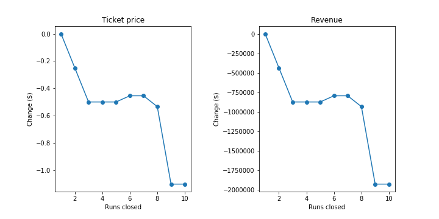

# Report for Big Mountain Resort

## Goal of the Project

Big Mountain Resort (BMR), a ski resort located in Montana, recently installed an additional chair lift to help distribution of visitors across the mountains. The resort's pricing strategy has been to charge a premium above the average price of resorts in its market segment. Big Mountain wants to find what facilities matter most to visitors and come up with a pricing strategy. This document provides the measures Big Mountain Resort should take to either cut cost without undermining the ticket price or support even a higher price.

## Recommendations

 The random forest model, outperforming the other naive and linear models, gives us the following predictions.

 1. The model says closing one run makes no difference. Closing 2 and 3 successively reduces support for ticket price and so revenue. If Big Mountain closes down 3 runs, it seems they may as well close down 4 or 5 as there's no further loss in ticket price. Increasing the closures down to 6 or more leads to a large drop. The same conclusion can be drawn for revenue, if we assume that the total visitor numer is 350,000 which is inelastic to the price change.

 2. The option that increases the vertical drop by adding a run to a point 150 feet lower down but requiring the installation of an additional chair lift to bring skiers back up, without additional snow making coverage and adding 2 acres of snow making cover gives the highest revenue increase by $20 million dollars.

## Future  Work

For more robust pricing strategy, I suggest we collect data on how visitors responds to a price change. Currently, the conclusion is drawn based on the assumption that the demand for Big Mountain Resort ticket is inelastic.
